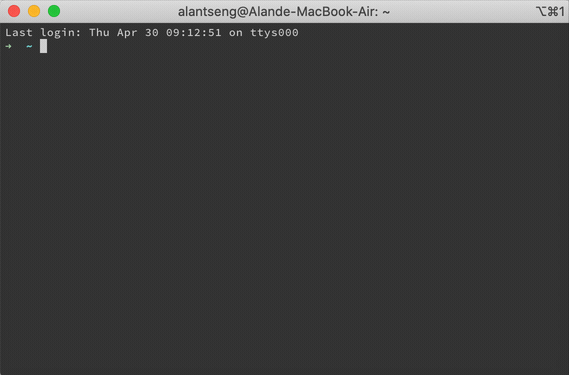
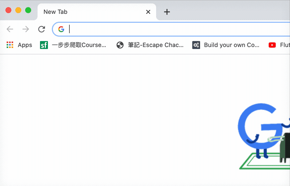
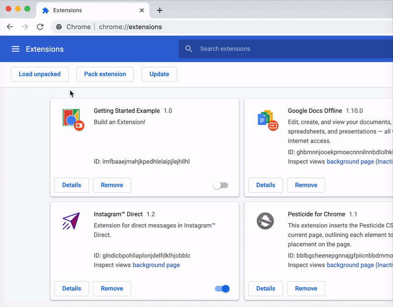
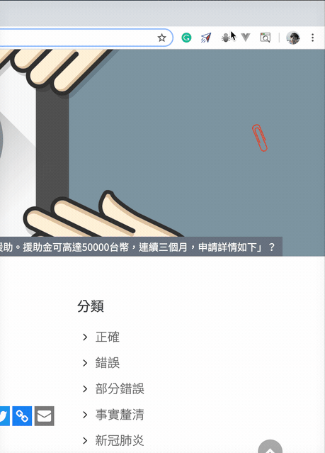

# SC-cofacts-extension
How to use?
1. clone this repo: git clone https://github.com/DSC-TW/SC-cofacts-extension.git

2. Go to chrome://extensions/ click load unpack and select the repo.

3. After seeing the icon in the upper right.
Select the text and click the icon in the upper right corner.

extension:
增加權限(cros problem):
在 manifest.json 的 permissions 裡加上網址
串接小群的API:
在 background.js 的 genericOnClick() > fetch裡的部分改成deploy cloud function API
修改版面:
popup.js、popup.html

流程邏輯
1. 按下滑鼠右鍵選取文字並送出
2. 執行 background.js 裡 genericOnClick() 
3. background.js 裡 genericOnClick() 的 fetch 是 打API freddy deploy的部分
4. Chrome Storage API存 {msg:"回傳結果" }
5. 點開右上 extension 看查詢結果 (popup.js) popup.js 拿 Storage API 資料

